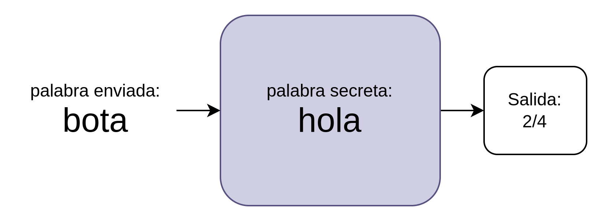
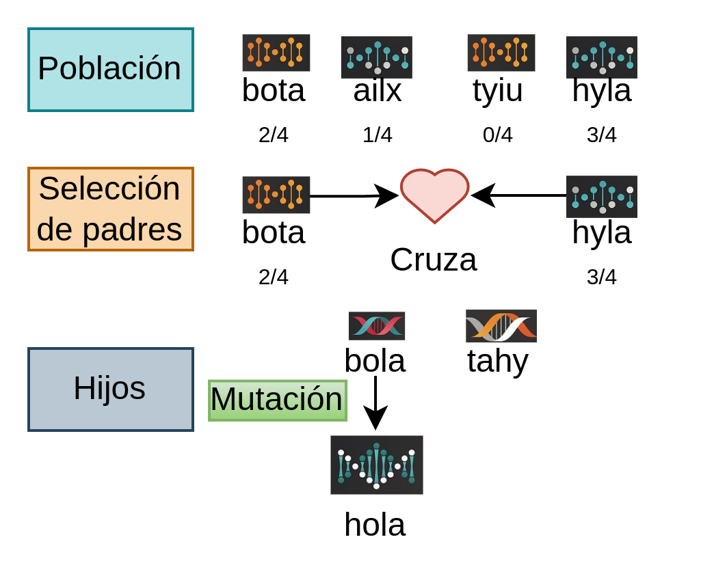
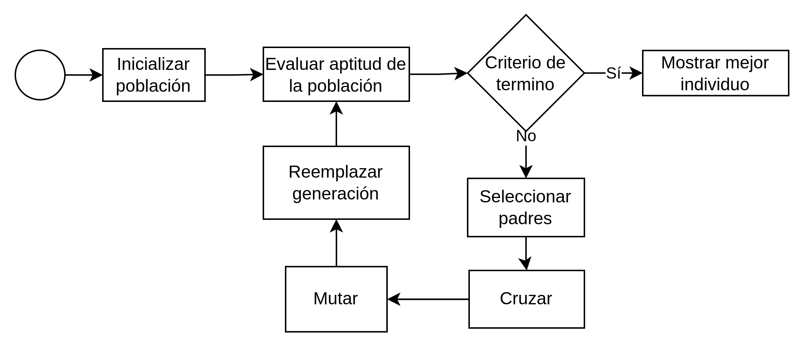

<style>
img[alt~="center"] {
  display: block;
  margin: 0 auto;
}
</style>

<!-- 

<!-- Diapositiva 1 -->

# Mono Infinito vs Algoritmo Genético

Adan E. Aguilar Justo


---

## El problema 

Tenemos un programa que oculta una palabra secreta, pero este programa es muy amable y nos dice cuantas letras hemos acertado en el lugar correcto.




---

## Teorema del mono infinito... 

El teorema del mono infinito afirma que un mono que pulsa al azar las teclas de un teclado durante una cantidad de tiempo infinito será capaz de teclear cualquier texto. (Émile Borel, 1913)


---

## Programemos a nuestro mono xD

Primero la caja negra, que recibe una entarda y retorna una puntuación.
```python
def cajanegra(entrada):
    secreta = "holamundo"
    puntuacion = 0
    for i in range(len(secreta)):
        puntuacion += 1 if secreta[i] == entrada[i] else 0
    return puntuacion/len(secreta)
```

---

## El mono


La función mono creará una palabra aleatoria usando solo lentras minúsculas.
```python
import random

def mono(longitud):
    palabra = ""
    for _ in range(longitud):
        palabra += chr(random.randint(97, 122))
    return palabra
```

---

## Ahora démosle tiempo infinito a nuestro mono

```python
g = 0
while(True):
    palabra = mono(4)
    puntuacion = cajanegra(palabra)
    print(g, palabra, puntuacion)
    if puntuacion == 1:
        break
    g += 1
```

---

# ¿Podriamos mejorar este proceso de búsqueda?


---

## ¿Qué son los algoritmos genéticos?

Los algoritmos genéticos son una técnica de búsqueda y optimización basada en la teoría de la evolución y la genética de Mendel.

- Utilizan conceptos de la genética y la selección natural.
- Modelan soluciones como "individuos" en una población.
- Utilizan operadores genéticos como la mutación y la recombinación (cruza) para explorar el espacio de soluciones.


---



---

<!-- Diapositiva 3 -->

## Componentes de un algoritmo genético

1. **Población**: Conjunto de posibles soluciones representadas como **individuos**.
2. **Función de aptitud**: Evalúa la calidad de cada individuo.
3. **Selección**: Escoge individuos para la reproducción según su **aptitud**.
4. **Reproducción**: Genera descendencia a través de operadores genéticos.
5. **Mutación**: Introduce cambios aleatorios en los individuos.
6. **Reemplazo**: Actualiza la población con la nueva generación de individuos.

---

<!-- Diapositiva 4 -->

## Flujo de algoritmo genético




---

## Evaluar y generar individuo

```python
def evaluar(original, individuo):
    puntuacion = 0
    for i in range(len(original)):
        puntuacion += 1 if original[i] == individuo[i] else 0
    return puntuacion/len(original)

def generar_idividuo(longitud):
    palabra = ""
    for _ in range(longitud):
        palabra += chr(random.randint(97, 122))
    return palabra
```

---

## Cruza

```python
def cruza(cadena1, cadena2):
    punto_cruza = random.randint(0, len(cadena1))
    cadena_hijo1 = cadena1[0:punto_cruza] + cadena2[punto_cruza:]
    cadena_hijo2 = cadena2[0:punto_cruza] + cadena1[punto_cruza:]
    return cadena_hijo1, cadena_hijo2

#pruebalo
print(cruza("holamundo", "mundohola"))
>('hundohola', 'molamundo')
```

---

## Mutación

```python
def mutacion(cadena, prob_mutar):
    cadena_mutada = list(cadena)
    for i in range(len(cadena)):
        cadena_mutada[i] = chr(random.randint(97, 122)) \
         if random.random() < prob_mutar else cadena_mutada[i]
    return "".join(cadena_mutada)
```

---

## Crear Población
```python
def crear_poblacion(tamano, original):
    poblacion = []
    for _ in range(tamano):
        palabra = generar_idividuo(len(original))
        poblacion.append(
            {
                "cadena": palabra,
                "aptitud": evaluar(original, palabra)
            }
        )
    return poblacion
```

---
## Seleccion de padres por ruleta
```python
def seleccion_padres(poblacion):
    padres = []
    while len(padres) < len(poblacion):
        for individuo in poblacion:
            fit = 0.1 if individuo['aptitud'] == 0 else individuo['aptitud']
            if random.random() < fit:
                padres.append(individuo)
    return padres
```
---

# Datos de población

```python
def estadisticas(poblacion):
    mejor = poblacion[0]
    peor = poblacion[0]
    suma_fit = 0
    for individuo in poblacion:
        mejor = individuo if individuo['aptitud'] >= mejor['aptitud'] else mejor
        peor = individuo if individuo['aptitud'] <= peor['aptitud'] else peor
        suma_fit += individuo['aptitud']
    return mejor, peor, suma_fit/len(poblacion)
```

---

# EL ALGORITMO

```python
prob_cruza = 1.0
prob_mutar = 0.1
generaciones = 100
tam_pop = 100
objetivo = "holamundo"

poblacion = crear_poblacion(tam_pop, objetivo)
for g in range(generaciones):
    mejor, peor, prom_fit = estadisticas(poblacion)
    print("{:.0f} {} {:.2f} {:.2f}".format(g, mejor['cadena'], mejor['aptitud'], prom_fit))

    if(mejor['aptitud'] == 1):
        break
```

---
```python
    padres = seleccion_padres(poblacion)
    
    siguiente_generacion = []
    for p in range(0, tam_pop, 2):
        hijo1 = {}
        hijo2 = {}
        if random.random() < prob_cruza:
            cadena_hijo1, cadena_hijo2 = cruza(padres[p]['cadena'], padres[p+1]['cadena'])
            hijo1 = {"cadena": cadena_hijo1, "aptitud":0 }
            hijo2 = {"cadena": cadena_hijo2, "aptitud":0 }
            #print(p, hijo1, hijo2)
        else:
            hijo1 = padres[p]
            hijo2 = padres[p+1]
```

---

```python
        hijo1['cadena'] = mutacion(hijo1['cadena'], prob_mutar)
        hijo2['cadena'] = mutacion(hijo2['cadena'], prob_mutar)
        hijo1['aptitud'] = evaluar(objetivo, hijo1['cadena'])
        hijo2['aptitud'] = evaluar(objetivo, hijo2['cadena'])
        siguiente_generacion.append(hijo1)
        siguiente_generacion.append(hijo2)

    poblacion = siguiente_generacion
    poblacion[0] = mejor
```

---

<!-- Diapositiva 5 -->

## Ventajas de los algoritmos genéticos

- Pueden encontrar soluciones óptimas o cercanas a lo óptimo en problemas complejos.
- Son flexibles y pueden adaptarse a diferentes tipos de problemas.
- Permiten explorar eficientemente el espacio de soluciones.
- Pueden manejar múltiples criterios de optimización.
- Pueden aplicarse a problemas del mundo real en diversas disciplinas.

---

# ¡Gracias!


Preguntas y respuestas.

- Jong, K. D. (2009). Evolutionary computation. Wiley Interdisciplinary Reviews: Computational Statistics, 1(1), 52-56.
